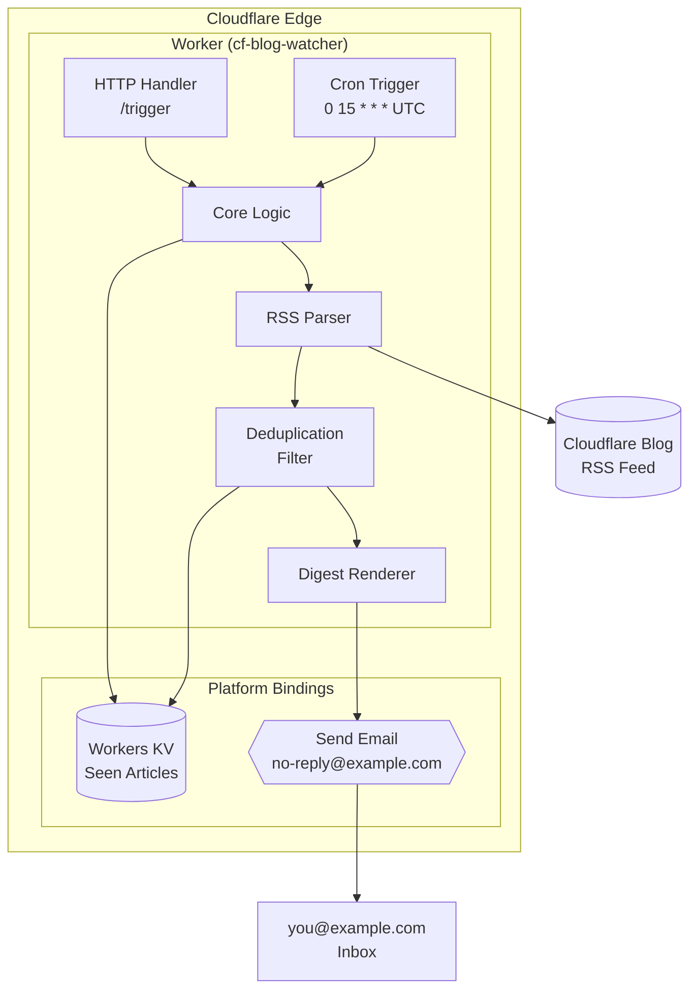

# Cloudflare Blog Watcher

A Cloudflare Worker that monitors the Cloudflare blog RSS feed and sends a daily email digest of new articles. Built entirely on Cloudflare's edge platform with zero external infrastructure.

## Architecture



## How It Works

1. **Scheduled Trigger** — Runs daily at 15:00 UTC via Cloudflare Cron Triggers
2. **Feed Fetch** — Pulls the latest articles from `https://blog.cloudflare.com/rss/`
3. **Deduplication** — Compares against previously seen articles stored in Workers KV
4. **Digest Generation** — Builds a clean markdown summary of new posts
5. **Email Delivery** — Sends the digest via Cloudflare's `send_email` binding
6. **State Update** — Persists the latest article list back to KV (keeps last 200)

## Manual Trigger

You can also trigger the digest on-demand via HTTP:

```bash
curl -H "X-Trigger-Token: $TRIGGER_TOKEN" \
  https://cf-blog-watcher.jsherron-test-account.workers.dev/trigger
```

## File Structure

```
cf-blog-watcher/
├── src/
│   └── worker.js          # Main Worker script
├── wrangler.jsonc         # Worker configuration, bindings, triggers
├── package.json           # Dependencies and scripts
├── .gitignore             # Excludes node_modules, .wrangler
├── README.md              # This file
└── AGENTS.md              # Development guide for AI agents
```

## Prerequisites

- [Node.js](https://nodejs.org/)
- [Wrangler CLI](https://developers.cloudflare.com/workers/wrangler/)
- Cloudflare account with:
  - A domain (e.g., `example.com`) configured for Email Routing
  - Workers KV namespace
  - Workers subscription

## Setup

1. Clone the repository
2. Install dependencies:
   ```bash
   npm install
   ```
3. Configure `wrangler.jsonc`:
   - Update `account_id` to your Cloudflare account
   - Replace KV namespace IDs with your own
   - Set `FROM_EMAIL` to an address on a domain you own with Email Routing enabled
   - Replace the preview KV ID for local development
4. Set the trigger token as a secret:
   ```bash
   npx wrangler secret put TRIGGER_TOKEN
   ```

## Deployment

```bash
npm run deploy
```

## Local Development

```bash
npm run dev
```

## Monitoring

```bash
npx wrangler tail
```

## Key Features

- **Zero Infrastructure** — No servers, no databases, no cron runners
- **Stateless with Persistence** — KV provides durable deduplication state
- **Secure Manual Trigger** — Token-protected HTTP endpoint for on-demand runs
- **Efficient Parsing** — Lightweight regex-based RSS parser (no XML libraries)
- **Bounded State** — Keeps only the last 200 article links to prevent KV bloat
