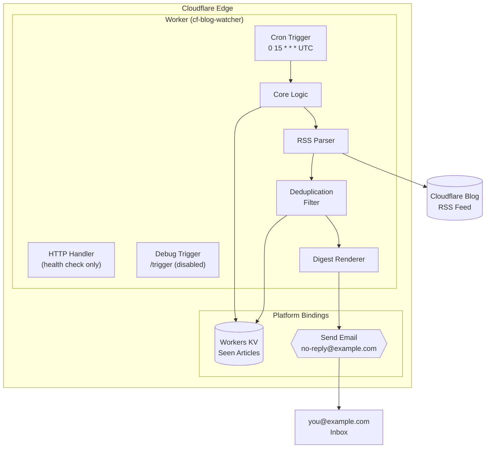

# Cloudflare Blog Watcher

A Cloudflare Worker that monitors the Cloudflare blog RSS feed and sends a daily email digest of new articles. Built entirely on Cloudflare's edge platform with zero external infrastructure.

## Architecture



## How It Works

1. **Scheduled Trigger** — Runs daily at 15:00 UTC via Cloudflare Cron Triggers
2. **Feed Fetch** — Pulls the latest articles from `https://blog.cloudflare.com/rss/`
3. **Deduplication** — Compares against previously seen articles stored in Workers KV
4. **Digest Generation** — Builds a clean markdown summary of new posts
5. **Email Delivery** — Sends the digest via Cloudflare's `send_email` binding
6. **State Update** — Persists the latest article list back to KV (keeps last 200)

## Security Model

- **`workers_dev: false`** — No public `.workers.dev` URL. The Worker is only accessible via Cron Triggers.
- **Debug trigger disabled by default** — The `/trigger` HTTP endpoint is only active when `ENABLE_DEBUG=true` is set.
- **Token authentication** — When debug mode is enabled, the trigger requires a secret `TRIGGER_TOKEN` header.

## Debug Mode (Manual Trigger)

For testing or ad-hoc runs, enable the debug trigger:

```bash
# Set debug flag
npx wrangler vars put ENABLE_DEBUG
# Enter value: true

# Deploy to apply
npm run deploy
```

Then trigger manually:
```bash
curl -H "X-Trigger-Token: $TRIGGER_TOKEN" \
  https://<your-worker-domain>/trigger
```

To disable:
```bash
npx wrangler vars delete ENABLE_DEBUG
npm run deploy
```

## Observability

### Live Log Tailing
Watch real-time execution logs:
```bash
npx wrangler tail
```

You will see structured output for each run:
```
=== Starting blog digest ===
Feed parsed: 20 total items
State loaded: 0 seen items
New items found: 20
KV write success: key='seen', 1057 bytes, 20 items
Sent digest with 20 new items
```

### KV Inspection
Check the deduplication state:
```bash
npx wrangler kv key get seen --binding "cf-blog-watcher" --remote
```

### Clear State (for testing)
```bash
npx wrangler kv key delete seen --binding "cf-blog-watcher" --preview false --remote
```

## Testing

```bash
npm test
```

Tests cover all core logic with mocked bindings (no live KV or email sending):

- **RSS Parsing** — `parseFeed()` extracts items, strips CDATA/HTML, handles edge cases
- **Digest Rendering** — `renderDigest()` formats markdown with truncation and fallbacks
- **State Management** — `loadState()` and `saveState()` with mocked KV
- **Security Gating** — `fetch` handler rejects `/trigger` when `ENABLE_DEBUG` is unset
- **Integration** — `runDigest()` end-to-end with mocked fetch, KV, and email

```bash
npm run test:watch  # watch mode for development
```

## File Structure

```
cf-blog-watcher/
├── src/
│   └── worker.js          # Main Worker script
├── test/
│   └── worker.test.js     # Unit + integration tests
├── vitest.config.js       # Vitest configuration
├── wrangler.jsonc         # Worker configuration, bindings, triggers
├── package.json           # Dependencies and scripts
├── .gitignore             # Excludes node_modules, .wrangler
├── README.md              # This file
└── AGENTS.md              # Development guide for AI agents
```

## Prerequisites

- [Node.js](https://nodejs.org/)
- [Wrangler CLI](https://developers.cloudflare.com/workers/wrangler/)
- Cloudflare account with:
  - A domain (e.g., `example.com`) configured for Email Routing
  - Workers KV namespace
  - Workers subscription

## Setup

1. Clone the repository
2. Install dependencies:
   ```bash
   npm install
   ```
3. Configure `wrangler.jsonc`:
   - Update `account_id` to your Cloudflare account
   - Replace KV namespace IDs with your own
   - Set `FROM_EMAIL` to an address on a domain you own with Email Routing enabled
   - Replace the preview KV ID for local development
   - Set `workers_dev: false` (recommended for production; set to `true` for testing)
4. Set secrets:
   ```bash
   npx wrangler secret put TRIGGER_TOKEN
   ```

## Deployment

```bash
npm run deploy
```

## Local Development

```bash
npm run dev
```

## Monitoring

```bash
npx wrangler tail
```

## Key Features

- **Zero Infrastructure** — No servers, no databases, no cron runners
- **Zero Public Surface** — No public URL by default; only Cron Triggers can invoke
- **Debug Mode** — Optional HTTP trigger for testing, gated by env var + secret token
- **Stateless with Persistence** — KV provides durable deduplication state
- **Efficient Parsing** — Lightweight regex-based RSS parser (no XML libraries)
- **Bounded State** — Keeps only the last 200 article links to prevent KV bloat
- **Full Observability** — Structured console logging + live tail via Wrangler
