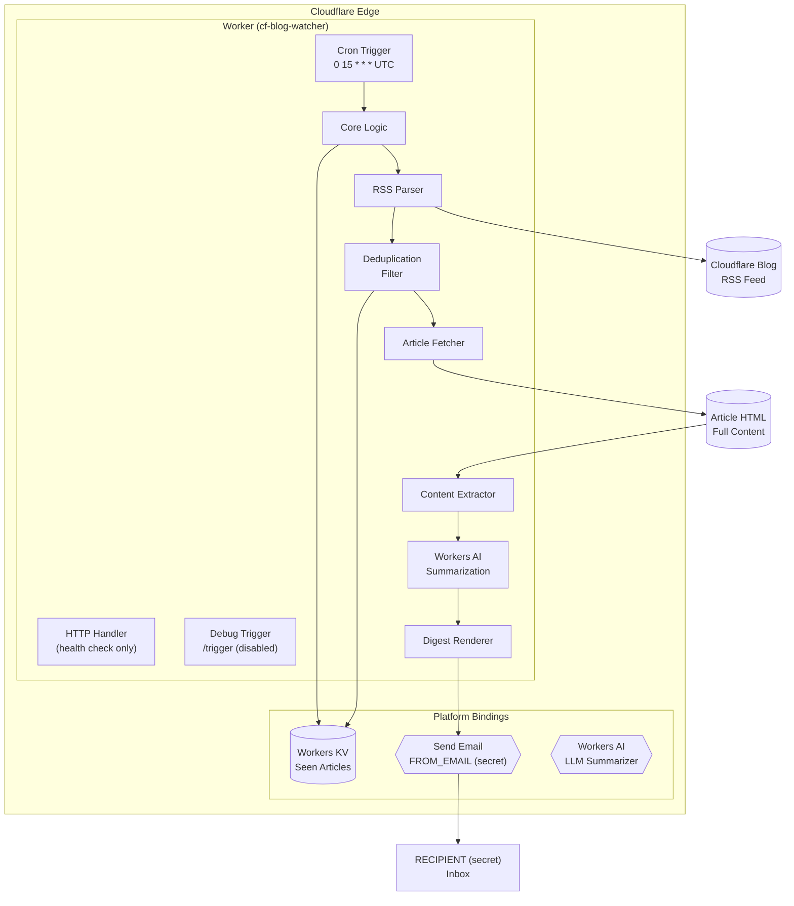

# Cloudflare Blog Watcher

A Cloudflare Worker that monitors the Cloudflare blog RSS feed, fetches full article content, generates AI-powered summaries, and sends a daily email digest of new articles. Built entirely on Cloudflare's edge platform with zero external infrastructure.

## Architecture



## How It Works

1. **Scheduled Trigger** — Runs daily at 15:00 UTC via Cloudflare Cron Triggers
2. **Config Load** — Reads live overrides from KV (`feed_url`, `ai_model`, `system_prompt`), falling back to defaults in `src/config.js`
3. **Feed Fetch** — Pulls the latest articles from the configured RSS feed
4. **Deduplication** — Compares against previously seen articles stored in Workers KV
5. **Article Fetch** — Downloads the full HTML of each new article
6. **Content Extraction** — Strips navigation, tags, scripts, and extracts readable article text
7. **AI Summarization** — Sends the article text to Workers AI for a skeptical 3-5 sentence technical analysis
8. **Digest Generation** — Builds a formatted email with article title, date, link, AI summary, and RSS teaser
9. **Email Delivery** — Sends the digest via Cloudflare's `send_email` binding
10. **State Update** — Persists the latest article list back to KV (keeps last 200)

## Security Model

- **`workers_dev: false`** — No public `.workers.dev` URL. The Worker is only accessible via Cron Triggers.
- **Debug trigger disabled by default** — The `/trigger` HTTP endpoint is only active when `ENABLE_DEBUG=true` is set.
- **Token authentication** — When debug mode is enabled, the trigger requires a secret `TRIGGER_TOKEN` header with a high-entropy value.

## Configuration

Defaults live in `src/config.js`. Override any of them at runtime via KV — no redeploy required:

| KV key | Overrides | Default |
|--------|-----------|---------|
| `feed_url` | RSS feed URL | `https://blog.cloudflare.com/rss/` |
| `ai_model` | Workers AI model | `@cf/meta/llama-3.1-8b-instruct-fast` |
| `system_prompt` | System prompt sent to the model | Built-in analyst prompt (`DEFAULT_SYSTEM_PROMPT`) |

```bash
# Override (inline value)
npx wrangler kv key put ai_model '@cf/meta/llama-4-scout' --binding "cf-blog-watcher" --remote

# Override (prompt from file)
npx wrangler kv key put system_prompt --path ./prompt.txt --binding "cf-blog-watcher" --remote

# Restore default
npx wrangler kv key delete system_prompt --binding "cf-blog-watcher" --remote
```

Missing, whitespace-only, or unreadable KV values fall back to the defaults. Email addresses (`RECIPIENT`, `FROM_EMAIL`) are secrets, not KV config — see Setup below.

## Debug Mode (Manual Trigger)

For testing or ad-hoc runs, enable the debug trigger:

```bash
# Add to wrangler.jsonc vars:
# "ENABLE_DEBUG": "true"
# Set workers_dev: true

# Deploy to apply
npm run deploy
```

Set a high-entropy trigger token:
```bash
node -e "console.log(crypto.randomUUID() + '-' + crypto.randomUUID())"
npx wrangler secret put TRIGGER_TOKEN
```

Then trigger manually:
```bash
curl -H "X-Trigger-Token: $TRIGGER_TOKEN" \
  https://<your-worker-domain>.workers.dev/trigger
```

To disable:
```bash
# Remove ENABLE_DEBUG from wrangler.jsonc vars
# Set workers_dev: false
npm run deploy
```

## Observability

### Live Log Tailing
Watch real-time execution logs:
```bash
npx wrangler tail
```

You will see structured output for each run:
```
=== Starting blog digest ===
Feed parsed: 20 total items
State loaded: 0 seen items
New items found: 20
Generating AI summaries...
Summarized: Cloudflare AI Search: give your agents a search engine for your data
...
Sent digest with 20 new items
```

### KV Inspection
Check the deduplication state:
```bash
npx wrangler kv key get seen --binding "cf-blog-watcher" --remote
```

### Clear State (for testing)
```bash
npx wrangler kv key delete seen --binding "cf-blog-watcher" --preview false --remote
```

## Testing

```bash
npm test
```

Tests cover all core logic with mocked bindings (no live KV or email sending):

- **RSS Parsing** — `parseFeed()` extracts items, strips CDATA/HTML, handles pubDate
- **Article Extraction** — `extractArticleText()` removes headers/scripts and extracts from `<article>`
- **Digest Rendering** — `renderDigest()` formats email with numbered list and separators
- **State Management** — `loadState()` and `saveState()` with mocked KV
- **Security Gating** — `fetch` handler rejects `/trigger` when `ENABLE_DEBUG` is unset
- **Integration** — `runDigest()` end-to-end with mocked fetch, KV, AI, and email

```bash
npm run test:watch  # watch mode for development
```

## File Structure

```
cf-blog-watcher/
├── src/
│   ├── worker.js          # Main Worker script
│   └── config.js          # Built-in defaults (feed URL, AI model, system prompt)
├── test/
│   └── worker.test.js     # Unit + integration tests
├── vitest.config.js       # Vitest configuration
├── wrangler.jsonc         # Worker configuration, bindings, triggers
├── .dev.vars.example      # Template for local secrets (copy to .dev.vars)
├── package.json           # Dependencies and scripts
├── .gitignore             # Excludes node_modules, .wrangler, .dev.vars
├── README.md              # This file
└── AGENTS.md              # Development guide for AI agents
```

## Prerequisites

- [Node.js](https://nodejs.org/)
- [Wrangler CLI](https://developers.cloudflare.com/workers/wrangler/)
- Cloudflare account with:
  - A domain (e.g., `example.com`) configured for Email Routing
  - Workers KV namespace
  - Workers AI access
  - Workers subscription

## Setup

1. Clone the repository
2. Install dependencies:
   ```bash
   npm install
   ```
3. Configure `wrangler.jsonc`:
   - Update `account_id` to your Cloudflare account
   - Replace KV namespace IDs with your own
   - Replace the preview KV ID for local development
   - Set `workers_dev: false` (recommended for production; set to `true` for testing)
4. Configure email addresses (never committed to git):
   - **Local dev**: copy `.dev.vars.example` to `.dev.vars` and fill in `RECIPIENT` and `FROM_EMAIL`
   - **Production**: set as secrets:
     ```bash
     npx wrangler secret put RECIPIENT
     npx wrangler secret put FROM_EMAIL
     ```
5. Set secrets:
   ```bash
   npx wrangler secret put TRIGGER_TOKEN
   ```

## Deployment

```bash
npm run deploy
```

## Local Development

```bash
npm run dev
```

## Monitoring

```bash
npx wrangler tail
```

## Key Features

- **AI-Generated Summaries** — Fetches full article HTML and uses Workers AI to generate unique analyses (not just RSS descriptions)
- **Live-Configurable** — Feed URL, AI model, and system prompt overridable via KV without redeploying
- **Smart Content Extraction** — Strips navigation, tag clouds, scripts, and extracts clean article text from `<article>` elements
- **Zero Infrastructure** — No servers, no databases, no cron runners
- **Zero Public Surface** — No public URL by default; only Cron Triggers can invoke
- **Debug Mode** — Optional HTTP trigger for testing, gated by env var + secret token
- **Stateless with Persistence** — KV provides durable deduplication state
- **Efficient Parsing** — Lightweight regex-based RSS parser (no XML libraries)
- **Bounded State** — Keeps only the last 200 article links to prevent KV bloat
- **Full Observability** — Structured console logging + live tail via Wrangler
